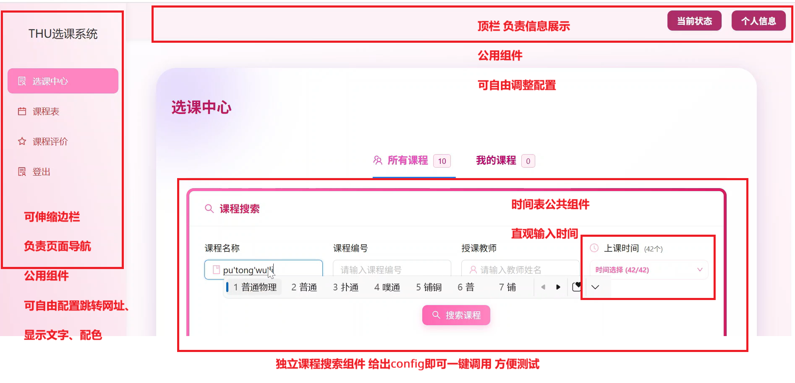
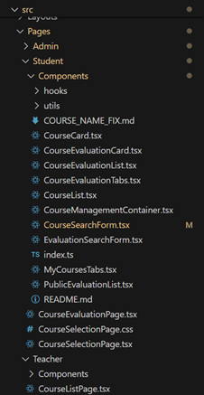
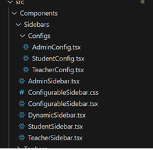
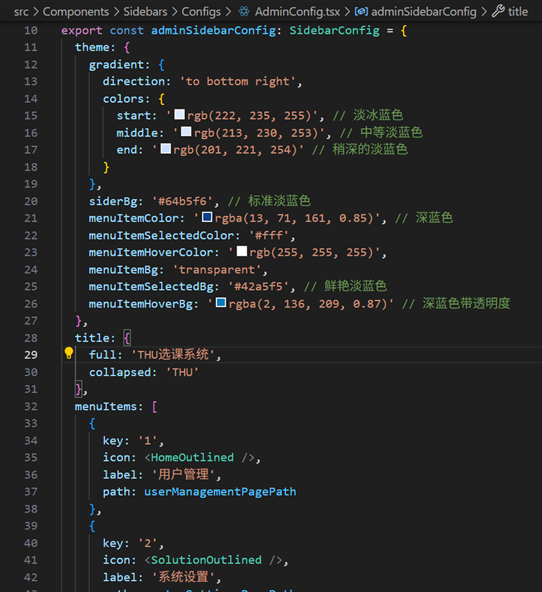
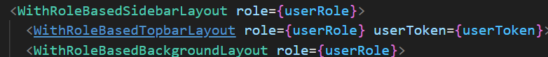
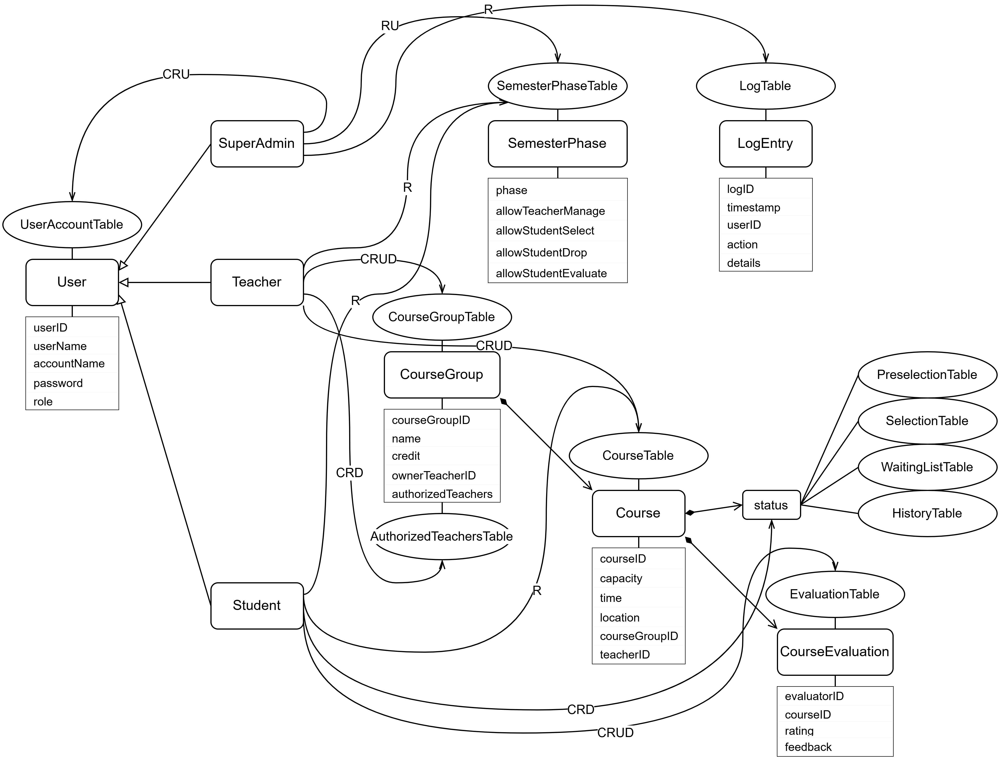

## 功能介绍

我们开发了一款新的清华大学选课系统，其基本架构为：

* 三类角色：
  * 超级管理员负责开设老师与学生账号、控制学期阶段与用户操作权限，可以查看系统日志。
  * 老师可以开课。
  * 学生可以选课与评价。
* 两个阶段：
  * 设立课程并预选阶段（阶段 1）。在权限开启时，可做以下操作：
    * 老师开设/删除课程组、授权/取消授权课程组下属老师、开设/删除课程、修改课程组/课程信息。
    * 学生查询课程信息、预选/取消预选课程。
  * 正选并补退选阶段（阶段 2）。在权限开启时，可做以下操作：
    * 学生查询课程信息、选课/退课、查看评价/评价上过的课程。
* 课程设置：
  * 由一位老师开设课程组，其作为课程组组长，指定名称（如微积分）与学分，并可授权其余老师开设课程组下属课程。
  * 被授权老师可在相应课程组下开设课程，指定上课地点与时间。
* 选课机制：
  * 阶段 1 与阶段 2 之间是抽签环节。与清华大学目前的情况类似，预选无先后顺序，对一门课，若预选人数超过课容量，则随机抽取学生选上，剩余学生以随机顺序进入 waiting list。正选为先到先得，有人退课时 waiting list 头部递补。

## 前端

前端采用 Typescript 编写确保类型安全，基于 React 框架处理响应，主要使用了 Ant Design 进行了 UI 设计。以下简单介绍几个实现两点。

### 页面：高度组件化

为了符合现代大规模系统的编程理念，页面代码采用了组件化 + 函数式 + 细菌化编程的设计思想，许多组件都高度可定制化。以上以选课中心页面举例。可以看到，整个页面就是各个小组件自然而然组合而成，而每个小组件内部又调用其他的工具组件，并用函数式的方式传给必要的参数，真正实现类型封装。下面是该页面的代码结构展示。

### 自定义组件：既可高度配置，也可一键调用

在组件的配置应该从繁还是从简的问题上，我们的设计是：给出高度定制化的选择，也给出方便的、可以一键调用的选项。这里我们以边栏的主题配置为例。我们希望根据用户身份的不同展示不同的配色主题。

在上面的页面中，`ConfigurableSidebar` 是一个可自由配置的边栏，我们通过预置的三组参数来实现自动生成管理员、教师、学生界面的配置。

预置的配色、导航栏信息

我们通过布局（Layouts）对各个组件进行包装。调用时一键即可调用多种布局。

## 后端

### 微服务功能

* UserAuthService：负责登入登出时管理 token。
* UserAccountService：管理员创建/修改用户、查询用户信息。
* CourseManagementService：老师对课程组、授权、课程相关的操作，以及查询课程信息。
* CourseSelectionService：学生选课操作、查询选课情况。
* CourseEvaluationService：学生评价课程。
* SemesterPhaseService：管理员控制学期阶段与各权限。
* SystemLogService：日志服务。

### 组织结构

CRUD 分别表示增查改删。

该系统主要包含几个对象：用户、课程组、课程、课程评价、学期状态、日志。它们之间的主要关系路线包括：

1. 管理员 $\xrightarrow{增,改,查}$ 用户列表（这里不能删，否则会出现开课老师被删除的情况）
2. 老师 $\xrightarrow{增,删,改,查}$ 课程组
3. 老师（课程组所有者）$\xrightarrow{增,删,查}$ 授权老师 $\xrightarrow{增,删,改,查}$ 课程
4. 学生 $\xrightarrow{增,删,查}$ 选课列表
5. 学生（选过课）$\xrightarrow{增,删,改,查}$ 课程评价
6. 管理员 $\xrightarrow{改,查}$ 学期状态 $\xrightarrow{控制}$ 老师与学生对课程的操作权限
7. 老师与学生对课程的操作 $\xrightarrow{增}$ 日志
